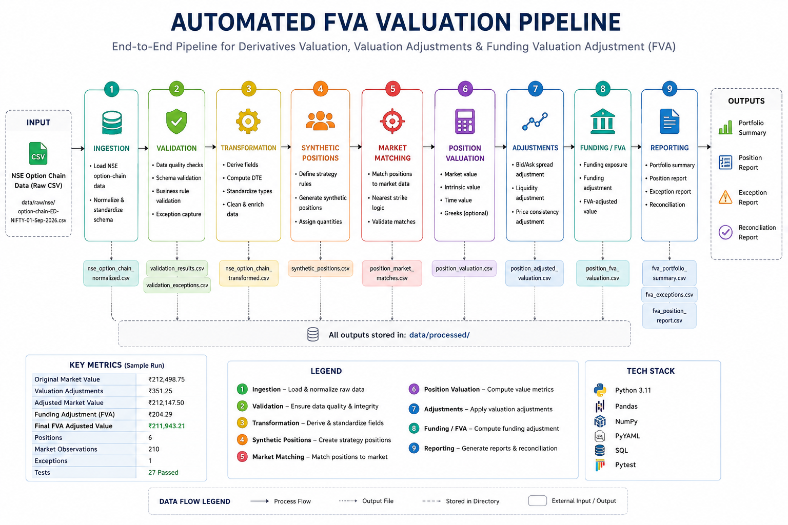

# Automated FVA Valuation Pipeline

An end-to-end Python pipeline for valuing an internal derivatives portfolio using market data from an NSE NIFTY option-chain snapshot.

The pipeline performs market-data ingestion, normalization, validation, transformation, synthetic position generation, market matching, position-level valuation, valuation adjustments, funding valuation adjustment (FVA), and portfolio-level reporting.

---

## 1. Project Overview

This project demonstrates an automated valuation workflow for an internal options portfolio.

The pipeline takes a raw NSE NIFTY option-chain snapshot and transforms it into a structured market-data dataset. Hypothetical internal option positions are then matched against available market observations and valued using the corresponding market prices.

The valuation is subsequently adjusted for:

- Bid-ask spread
- Liquidity
- Economic consistency
- Funding costs / FVA

The final stage produces portfolio-level reconciliation and an exception report for positions requiring attention.

---

## 2. Business Objective

The objective is to demonstrate how a derivatives valuation workflow can be automated from raw market data through final portfolio reporting.

The pipeline is designed around the following valuation flow:

```text
Raw NSE Option Chain
        |
        v
     Ingestion
        |
        v
    Validation
        |
        v
   Transformation
        |
        v
Synthetic Positions
        |
        v
  Market Matching
        |
        v
Position Valuation
        |
        v
Valuation Adjustments
        |
        v
    Funding / FVA
        |
        v
Portfolio Reporting
        |
        v
    Exceptions

---

## 3. Pipeline Architecture



The architecture separates market-data processing, valuation, adjustments, funding, and reporting into independently testable stages.

---

## 4. Results & Validation

### Sample Run

| Metric | Result |
|---|---:|
| Positions Processed | 6 |
| Market Observations | 210 |
| Original Market Value | ₹212,498.75 |
| Valuation Adjustments | ₹351.25 |
| Adjusted Market Value | ₹212,147.50 |
| Funding Adjustment | ₹204.29 |
| Final FVA-Adjusted Value | ₹211,943.21 |
| Exceptions | 1 |
| Automated Tests | 27 passed |

### Test Coverage

The project includes automated tests covering:

- Data validation
- Position valuation
- Valuation adjustments
- Funding / FVA calculations
- End-to-end pipeline execution
- Portfolio reporting

Latest test run:

```text
27 passed in 0.61s


Portfolio Reconciliation

Original Market Value
        ↓
₹212,498.75
        ↓
Valuation Adjustments
        ↓
₹351.25
        ↓
Adjusted Market Value
        ↓
₹212,147.50
        ↓
Funding Adjustment
        ↓
₹204.29
        ↓
Final FVA-Adjusted Value
        ↓
₹211,943.21
Exceptions

The sample portfolio produced 1 exception requiring attention.

The flagged position was identified because its valuation price was below its calculated intrinsic value:

Position: POS006
Option Type: PE
Strike: 25,000
Quantity: 100
Valuation Price: 826.00
Intrinsic Value: 909.15
Exception: PRICE_BELOW_INTRINSIC

The exception is preserved in the generated exception report for audit and review.

## 5. Data Source & Methodology

### Data Source

The pipeline uses a raw **NSE NIFTY option-chain CSV snapshot** as the market-data input.

The source dataset contains call and put option observations including:

- Open interest
- Change in open interest
- Volume
- Implied volatility
- Last traded price (LTP)
- Price change
- Bid quantity
- Bid price
- Ask price
- Ask quantity
- Strike price

The raw market-data file is stored under:

```text
data/raw/nse/
Data Processing

The raw NSE option-chain structure is normalized from a wide CALL/PUT format into a standardized contract-level dataset.

The ingestion layer:

Loads the raw NSE CSV.
Separates CALL and PUT observations.
Standardizes column names.
Converts numeric fields into appropriate numeric types.
Handles NSE missing-value representations.
Adds underlying and expiry metadata.
Produces one option contract per row.

The normalized dataset is written to:

data/processed/nse_option_chain_normalized.csv
Validation

The validation layer performs data-quality and business-rule checks before downstream valuation.

Validation includes:

Required-column validation
Option-type validation
Strike-price validation
Missing-value detection
Expiry validation
Negative market-value checks
Bid/ask consistency checks
Duplicate-contract detection

Invalid observations are identified before they proceed through the valuation workflow.

Transformation

The transformation layer derives and standardizes fields required by downstream valuation components.

The transformed market-data dataset is stored at:

data/processed/nse_option_chain_transformed.csv
Synthetic Internal Positions

The project generates synthetic internal option positions for valuation purposes.

These positions are hypothetical portfolio records created from contracts available in the NSE option-chain snapshot. They are not represented as NSE transaction records.

Each position contains portfolio attributes such as:

Position ID
Trade date
Underlying
Expiry
Option type
Strike price
Quantity

The generated positions are stored at:

data/processed/synthetic_positions.csv
Market Matching

Each synthetic position is matched against the normalized market dataset using the relevant option characteristics.

The matching process uses:

Underlying
Option type
Expiry
Strike price

The resulting market matches are stored at:

data/processed/position_market_matches.csv
Position Valuation

Position-level valuation calculates:

Market value
Intrinsic value
Time value

Position quantity and sign are incorporated into the valuation calculations.

The valuation output is stored at:

data/processed/position_valuation.csv
Valuation Adjustments

The valuation is adjusted for market and model considerations including:

Bid-ask spread
Liquidity
Economic consistency

The individual adjustment components are aggregated into a total valuation adjustment.

The adjusted valuation output is stored at:

data/processed/position_adjusted_valuation.csv
Funding Valuation Adjustment (FVA)

Funding exposure is calculated from the adjusted market value.

The funding layer applies the configured funding rate and time to expiry to calculate the funding adjustment.

The final position-level FVA-adjusted value is calculated as:

Adjusted Market Value
        -
Funding Adjustment
        =
FVA-Adjusted Market Value

The final output is stored at:

data/processed/position_fva_valuation.csv
Portfolio Reporting

The reporting layer aggregates position-level results into portfolio-level outputs.

It produces:

Portfolio FVA summary
Position-level report
Exception report
Valuation reconciliation

Generated reports are stored under:

data/processed/

## 6. Project Structure

```text
automated-fva-valuation-pipeline/
│
├── config/
│   └── config.yaml
│
├── data/
│   ├── raw/
│   │   └── nse/
│   │       └── option-chain-ED-NIFTY-01-Sep-2026.csv
│   │
│   └── processed/
│       ├── nse_option_chain_normalized.csv
│       ├── nse_option_chain_transformed.csv
│       ├── synthetic_positions.csv
│       ├── position_market_matches.csv
│       ├── position_valuation.csv
│       ├── position_adjusted_valuation.csv
│       ├── position_fva_valuation.csv
│       ├── fva_position_report.csv
│       ├── fva_portfolio_summary.csv
│       └── fva_exceptions.csv
│
├── docs/
│   └── architecture.png
│
├── sql/
│   ├── schema.sql
│   └── queries.sql
│
├── src/
│   ├── ingestion.py
│   ├── validation.py
│   ├── transformations.py
│   ├── synthetic_positions.py
│   ├── market_matching.py
│   ├── valuation.py
│   ├── adjustments.py
│   ├── funding.py
│   └── reporting.py
│
├── tests/
│   ├── test_pipeline.py
│   ├── test_validation.py
│   ├── test_valuation.py
│   ├── test_adjustments.py
│   └── test_funding.py
│
├── main.py
├── run_pipeline.py
├── requirements.txt
├── .gitignore
└── README.md

## 7. How to Run
Install Dependencies
pip install -r requirements.txt
Run the Complete Pipeline

From the project root:

python run_pipeline.py

The pipeline executes all stages automatically:

Ingestion
→ Validation
→ Transformation
→ Synthetic Positions
→ Market Matching
→ Position Valuation
→ Valuation Adjustments
→ Funding / FVA
→ Portfolio Reporting
Run Tests
python -m pytest tests -v

Expected result:

27 passed
Run Individual Stages

Each processing stage can also be executed independently:

python src/ingestion.py
python src/validation.py
python src/transformations.py
python src/synthetic_positions.py
python src/market_matching.py
python src/valuation.py
python src/adjustments.py
python src/funding.py
python src/reporting.py

## 8. Outputs
The primary outputs are:
Output	Description
position_market_matches.csv	Internal positions matched to market observations
position_valuation.csv	Position-level market, intrinsic and time value
position_adjusted_valuation.csv	Valuation after market adjustments
position_fva_valuation.csv	Final FVA-adjusted position values
fva_portfolio_summary.csv	Portfolio-level valuation reconciliation
fva_position_report.csv	Concise position-level report
fva_exceptions.csv	Positions requiring review

## 9. Technology Stack
Python 3.11
Pandas — data processing and transformation
Pytest — automated testing
SQL — schema and analytical query layer
YAML — configuration
Git / GitHub — version control
PowerShell — local execution and automation

## 10. Key Design Principles
The pipeline follows several design principles:

Modular processing — each valuation stage is implemented independently.
Deterministic workflow — the complete pipeline can be executed through a single entry point.
Explicit valuation logic — market value, intrinsic value, time value, adjustments and funding are calculated separately.
Position-sign awareness — long and short positions are represented using signed quantities.
Validation before valuation — data-quality checks are performed before downstream calculations.
Exception visibility — economically inconsistent or otherwise problematic positions are explicitly reported.
Auditability — intermediate datasets are preserved as separate processing outputs.
Testability — core valuation components are covered by automated unit tests.

## 11. Assumptions & Limitations

This project is designed as a portfolio demonstration of an automated derivatives valuation workflow.

### Assumptions

- The NSE option-chain CSV represents a market-data snapshot rather than a live market feed.
- Internal portfolio positions are synthetic and created for demonstration purposes.
- The funding rate used by the FVA layer is a configurable synthetic internal rate.
- Valuation is performed using the matched market observation available in the dataset.
- Contract lot-size treatment is kept explicit and is not silently assumed in the position-level valuation.
- Funding adjustment is calculated using funding exposure, funding rate and time to expiry.

### Limitations

This implementation is not intended to represent a production-grade bank valuation system.

It does not currently include:

- Live market-data connectivity
- Real internal trade-book connectivity
- Counterparty credit valuation adjustment (CVA)
- Debit valuation adjustment (DVA)
- Collateral valuation adjustment (ColVA)
- Stochastic funding curves
- Discount curves or yield-curve bootstrapping
- Full option-pricing models such as Black-Scholes or local/stochastic volatility models
- Real-time risk aggregation
- Production database integration
- Authentication or access-control infrastructure
- Regulatory reporting integration

The project intentionally focuses on demonstrating the **data-to-valuation-to-FVA workflow**, modular design, validation, testing, reconciliation and exception handling.

---

## 12. Future Improvements

Potential extensions include:

- Integrate live NSE or approved market-data feeds.
- Replace synthetic positions with trade-book data.
- Introduce configurable funding curves instead of a single funding rate.
- Add Black-Scholes and other option-pricing models.
- Implement Greeks calculation and risk aggregation.
- Add CVA, DVA and other XVA components.
- Integrate a relational database for positions and market data.
- Add automated CI/CD testing with GitHub Actions.
- Add dashboard-based portfolio monitoring.
- Introduce logging and structured audit trails.
- Containerize the application using Docker.
- Add production-grade configuration and environment management.

---

## 13. Project Outcome

This project demonstrates an end-to-end workflow for transforming raw derivatives market data into an auditable portfolio valuation and FVA result.

The implementation combines:

```text
Market Data Engineering
        +
Data Quality Validation
        +
Financial Valuation
        +
Valuation Adjustments
        +
Funding Valuation Adjustment
        +
Automated Testing
        +
Exception Reporting

The final pipeline provides a reproducible framework that can be extended toward more sophisticated XVA, derivatives valuation and financial data engineering use cases.

14. Disclaimer

This project is for educational and portfolio demonstration purposes.

The market data, internal positions and funding assumptions used in the project should not be interpreted as live trading, investment, accounting or regulatory valuation data.

15. License
This project is provided for educational and portfolio demonstration purposes.